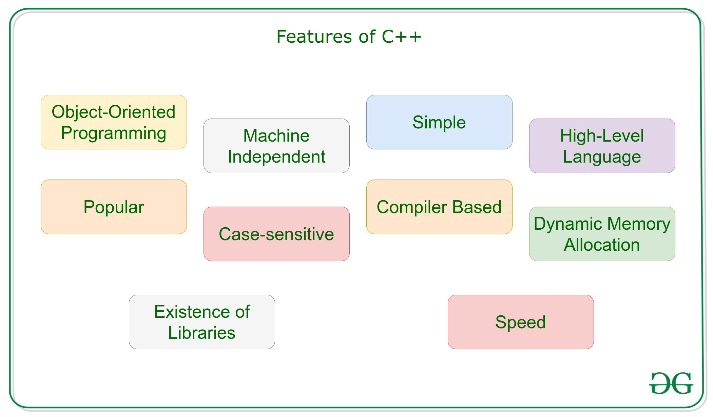

# Description

C++ is a mid-leveled object oriented, general-purpose programming language designed for system and application programming and is widely used nowadays for competitive programming.

It has imperative, object-oriented, and generic programming features.

&nbsp;

&nbsp;

# History

The programming language was created, designed & developed by a **_Danish Computer Scientist – Bjarne Stroustrup_** at Bell Telephone Laboratories (now known as Nokia Bell Labs) in Murray Hill, New Jersey.

As he wanted a flexible & a dynamic language which was similar to C with all its features, but with additionality of active type checking, basic inheritance, default functioning argument, classes, inlining, etc. and hence C with Classes (C++) was launched.

C++ was initially known as “C with classes, ” and was renamed C++ in 1983. ++ is shorthand for adding one to variety in programming; therefore C++ roughly means that “one higher than C.”

&nbsp;

&nbsp;

# Features of C++

C++ provides a lot of features that are given below.

- Simple

- Portability (Portability is a characteristic attributed to a computer program if it can be used in an operating systems other than the one in which it was created without requiring major rework)

- Powerful and Fast
- Rich Library
- Machine Independent but Platform Dependent (compiled programs on Linux won’t run on Windows)
- Mid-level programming language
- Structured programming language
- Object-Oriented
- Case Sensitive
- Compiler Based
- Syntax based language
- Pointers
- Dynamic Memory Management

&nbsp;

&nbsp;

&nbsp;

# Note

- It allows us to follow both procedural as well as functional approach to design our flow of control.

- In C++ Language, `.cpp` file contains source code,and we can also edit this code. `.exe` file contains the application,which is the only file that can be executed

- C++ can do both low-level & high-level programming (we can do both systems-programming (drivers, kernels, networking etc.)) and build large-scale user applications (Media Players, Photoshop, Game Engines etc.)That is the reason why C++ is known as a **mid-level programming language**.

&nbsp;

&nbsp;

# Difference between C and C++

- C++ was developed as an extension of C, and both languages have almost the same syntax.

- The main difference between C and C++ is that C++ support classes and objects, while C does not.

&nbsp;

&nbsp;

# Strongly vs. weakly typed

`Weakly-typed languages` make conversions between unrelated types implicitly; whereas, `strongly-typed languages` don’t allow implicit conversions between unrelated types.

`Python` is strongly-typed language and `JavaScript` is weakly-typed language.

&nbsp;

&nbsp;
