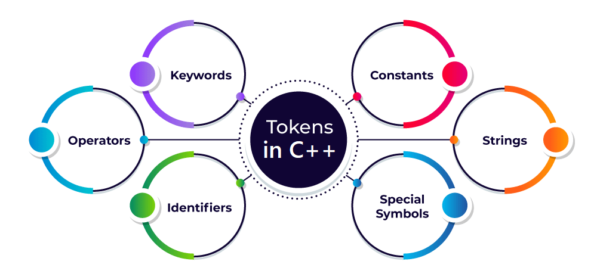

# Token

A token can be defined as the smallest individual element of the C++ programming language that is meaningful to the compiler.

It is the basic component of a C++ program.

&nbsp;

# Types of Tokens

The tokens of C++ language can be classified into `six` types based on the functions they are used to perform. The types of C++ tokens are as follows:

- Keywords
- Identifiers
- Constants
- Strings
- Special Symbols
- Operators

&nbsp;

&nbsp;

# Identifiers

In C++, entities like variables, functions, classes, or structs must be given unique names within the program so that they can be uniquely identified. The unique names given to these entities are known as identifiers.

&nbsp;

# Keywords

Keywords in C++ are the tokens that are the reserved words in programming languages that have their specific meaning and functionalities within a program. Keywords cannot be used as an identifier to name any variables.

&nbsp;

# 3. Constants

Constants are the tokens in C++ that are used to define variables at the time of initialization and the assigned value cannot be changed after that.

We can define the constants in C++ in two ways that are using the ‘const’ keyword and ‘#define’ preprocessor directive. Let’s see both methods one by one.

&nbsp;

# Strings

In C++, a string is not a built-in data type like ‘int’, ‘char’, or ‘float’. It is a class available in the STL library which provides the functionality to work with a sequence of characters, that represents a string of text.

&nbsp;

# Special Symbols

Special symbols are the token characters having specific meanings within the syntax of the programming language. These symbols are used in a variety of functions, including ending the statements, defining control statements, separating items, and more.

Below are the most common special symbols used in C++ programming:

- Semicolon (;): It is used to terminate the statement.

- Square brackets []: They are used to store array elements.
- Curly Braces {}: They are used to define blocks of code.
- Scope resolution (::): Scope resolution operator is used to access members of namespaces, classes, etc.
- Dot (.): Dot operator also called member access operator used to access class and struct members.
- Assignment operator ‘=’: This operator is used to assign values to variables.
- Double-quote (“): It is used to enclose string literals.
- Single-quote (‘): It is used to enclose character literals.

&nbsp;

# Operators

C++ operators are special symbols that are used to perform operations on operands such as variables, constants, or expressions. A wide range of operators is available in C++ to perform a specific type of operations which includes arithmetic operations, comparison operations, logical operations, and more.

&nbsp;

&nbsp;

&nbsp;

&nbsp;
