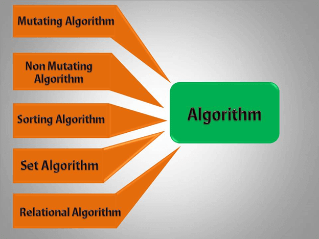

- STL = Standard Template Library

- STL is Standard Template Library which contains a lot of pre-defined templates in terms of container or classes.

- STL has 4 components:
  - Algorithms
  - Containers
  - Functors
  - Iterators

&nbsp;

&nbsp;

# Algorithm

- The algorithm defines a collection of functions specially designed to be used on a range of elements.

- They act on containers and provide means for various operations for the contents of the containers.

&nbsp;

&nbsp;

# Containers

- Containers can be described as the objects that hold the data of the same type. Containers are used to implement different data structures for example arrays, list, trees, etc.

- Classification of containers :

  - Sequence containers
    - vector
    - list
    - deque
    - arrays
    - forward_list
  - Associative containers
    - set
    - multiset
    - map
    - multimap
  - Derived containers or Container Adaptors
    - stack
    - queue
    - priority_queue
